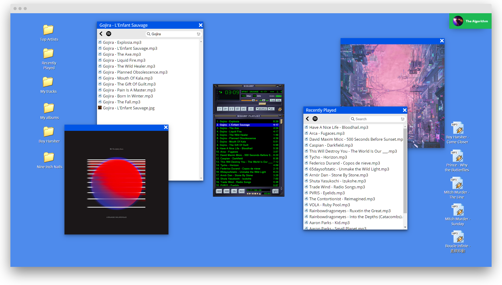

  

## Overview

<a href="http://winampify.io">Winampify</a> aims at providing an OS-like interface to interact with Spotify in the browser.

Artists, albums and tracks are all rendered as files and folders and can easily be manipulated and played in the Winamp re-implementation <a href="https://github.com/captbaritone/webamp">Webamp</a>.

TODO:

- [ ] Fix search feature
- [ ] Error middleware
- [x] Implement better login logic
- [x] Hide URL params after tokens are consumed
- [ ] Extends explorer content with track details
- [ ] Implement popover with track details
- [ ] Improve windows manager
- [ ] Playlist discovery and playlist creation

## Motivation

Building softwares should stay fun. This project is mostly a sandbox for me to try and improve my knowledge of React and TypeScript. It is also the first large-scale project that I'm undertaking on my own, and is in constant need of refactoring.

## Development

`npm run build-webamp`  
`npm run start`

## Requirements

You need a Spotify Premium Account to access Winampify.

## Thank you

Winamp's reimplementation is the work of <a href="https://github.com/captbaritone">captbaritone-js</a>.

## License

This project is released under the [MIT License](LICENSE.txt).
